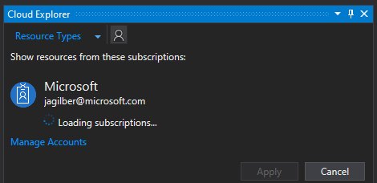
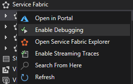
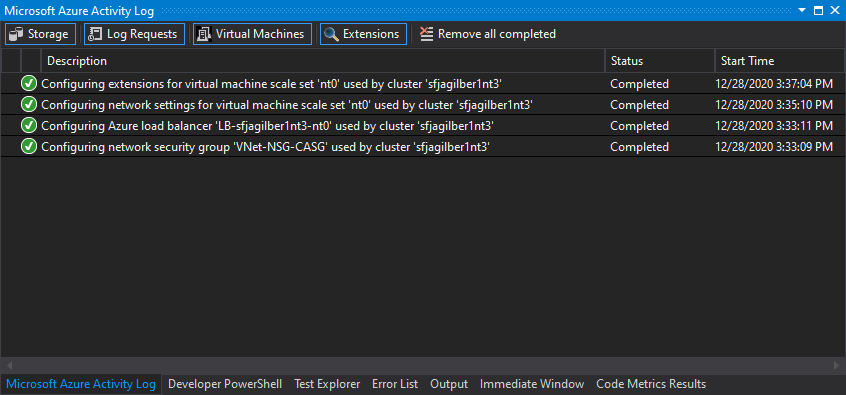
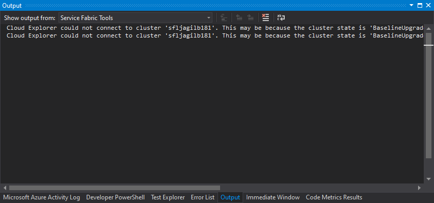
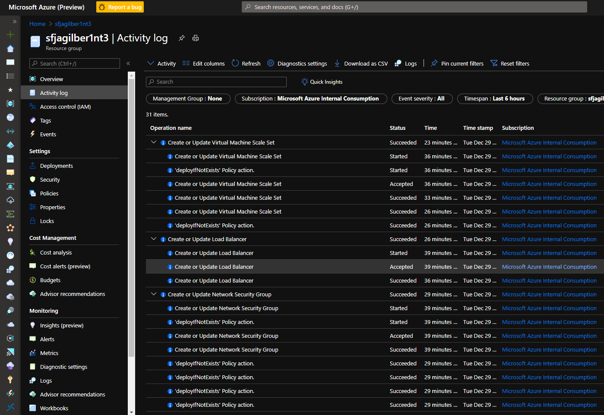

# Troubleshooting Service Fabric Visual Studio Remote Debugging

>[Overview](#overview)  
>[Requirements](#requirements)  
>[Example Configuration](#example-configuration)  
>[Steps](#steps)  
>[Process](#process)  
>>[Visual Studio Cloud Explorer / Enable Debugging](#visual-studio-cloud-explorer-/-enable-debugging)  
>
>[Troubleshooting](#Troubleshooting)  
>>[Visual Studio Developer Machine Troubleshooting](#visual-studio-developer-machine-troubleshooting)  
>>[Remote Debugger Node Extension Troubleshooting on Node](#remote-debugger-node-extension-troubleshooting-on-node)
>
>[Known Issues](#known-issues)
>>[Timeout](#timeout)
>>>[Timeout Mitigation](#timeout-mitigation)

## Overview

For troubleshooting a service fabric application, on a development machine with Visual Studio and Service Fabric SDK installed, a deployed Service Fabric application can be remotely debugged on one or more nodes. Official documentation for this process is located in [Debug your Service Fabric application by using Visual Studio](https://docs.microsoft.com/azure/service-fabric/service-fabric-debugging-your-application). Setting up a multi-node cluster for debugging in Azure is a complex process and can fail in multiple areas. Other debugging options are available and may be preferred such as using a local dev cluster that is installed as part of the SDK or by connecting directly to node remotely with [RDP](https://docs.microsoft.com/azure/service-fabric/service-fabric-cluster-remote-connect-to-azure-cluster-node) and debugging process locally on node. This guide focuses on the overall process Visual Studio performs when enabling debugging for an Azure cluster and how to troubleshoot.  

## Requirements

- Visual Studio 2017/2019
- Service Fabric SDK
- Service Fabric cluster
- Deployed Service Fabric application

## Example Configuration

- Visual Studio 2019
- Service Fabric SDK
- Azure Service Fabric 3 node cluster
- Deployed Service Fabric Voting application. [source](https://github.com/Azure-Samples/service-fabric-dotnet-quickstart/). [tutorial](https://docs.microsoft.com/azure/service-fabric/service-fabric-tutorial-create-dotnet-app)
- Ports 32398, 31399, 31398, 30398

## Steps

1. Open Service Fabric project in Visual Studio and deploy application to cluster if not already  
1. Open 'Cloud Explorer' from 'View' menu  
1. Authenticate to Azure  
    
1. Navigate to correct subscription and expand 'Service Fabric' tree view item  
1. Right click on cluster with deployed application and select 'Enable Debugging'  
    

## Process

This is the high level process Visual studio performs when enabling debugging for an Azure Service Fabric cluster:

### Visual Studio Cloud Explorer / Enable Debugging  

1. Cluster nodetypes and node attributes list is refreshed  

1. Network Security Groups (NSG) are checked and updated  

    - NSG is checked to see if node debug ports are allowed:  

      connectorPort: 30398  
      forwarderPort: 31398  
      forwarderPortx86: 31399  
      fileUploadPort: 32398  
      etwListenerPort: 810  

    - If ports are not allowed, new inbound rules are added TCP allow inbound starting at priority 1000 in 100 increments  

        ```json
        {
            "name": "connectorPort",
            "type": "Microsoft.Network/networkSecurityGroups/securityRules",
            "properties": {
                "protocol": "Tcp",
                "sourcePortRange": "*",
                "destinationPortRange": "30398",
                "sourceAddressPrefix": "*",
                "destinationAddressPrefix": "*",
                "access": "Allow",
                "priority": 1000,
                "direction": "Inbound",
                "sourcePortRanges": [],
                "destinationPortRanges": [],
                "sourceAddressPrefixes": [],
                "destinationAddressPrefixes": []
            }
        }, 
        {
            "name": "forwarderPort",
            "type": "Microsoft.Network/networkSecurityGroups/securityRules",
            "properties": {
                "protocol": "Tcp",
                "sourcePortRange": "*",
                "destinationPortRange": "31398",
                "sourceAddressPrefix": "*",
                "destinationAddressPrefix": "*",
                "access": "Allow",
                "priority": 1100,
                "direction": "Inbound",
                "sourcePortRanges": [],
                "destinationPortRanges": [],
                "sourceAddressPrefixes": [],
                "destinationAddressPrefixes": []
            }
        }, 
        {
            "name": "forwarderPortx86",
            "type": "Microsoft.Network/networkSecurityGroups/securityRules",
            "properties": {
                "protocol": "Tcp",
                "sourcePortRange": "*",
                "destinationPortRange": "31399",
                "sourceAddressPrefix": "*",
                "destinationAddressPrefix": "*",
                "access": "Allow",
                "priority": 1200,
                "direction": "Inbound",
                "sourcePortRanges": [],
                "destinationPortRanges": [],
                "sourceAddressPrefixes": [],
                "destinationAddressPrefixes": []
            }
        }, 
        {
            "name": "fileUploadPort",
            "type": "Microsoft.Network/networkSecurityGroups/securityRules",
            "properties": {
                "protocol": "Tcp",
                "sourcePortRange": "*",
                "destinationPortRange": "32398",
                "sourceAddressPrefix": "*",
                "destinationAddressPrefix": "*",
                "access": "Allow",
                "priority": 1300,
                "direction": "Inbound",
                "sourcePortRanges": [],
                "destinationPortRanges": [],
                "sourceAddressPrefixes": [],
                "destinationAddressPrefixes": []
            }
        }
        ```

1. Load Balancers and NodeTypes (virtual machine scaleset) checked  

1. Load Balancers NAT rules are updated

    - Load Balancer NAT Pools are created for front end configuration with generated unique name  
    - Duplicates are checked and removed  

    ```json
    , {
    "name": "DebuggerListenerNatPool-a0rja0egeh.0",
    "type": "Microsoft.Network/loadBalancers/inboundNatRules",
    "properties": {
        "provisioningState": "Succeeded",
        "frontendIPConfiguration": {
            "id": "/subscriptions/{{subscription id}}/resourceGroups/{{resource group name}}/providers/Microsoft.Network/loadBalancers/LB-{{resource group name}}-nt0/frontendIPConfigurations/LoadBalancerIPConfig"
        },
        "frontendPort": 30398,
        "backendPort": 30398,
        "enableFloatingIP": false,
        "idleTimeoutInMinutes": 4,
        "protocol": "Tcp",
        "enableDestinationServiceEndpoint": false,
        "enableTcpReset": false,
        "allowBackendPortConflict": false,
        "backendIPConfiguration": {
            "id": "/subscriptions/{{subscription id}}/resourceGroups/{{resource group name}}/providers/Microsoft.Compute/virtualMachineScaleSets/nt0/virtualMachines/0/networkInterfaces/NIC-0/ipConfigurations/NIC-0"
        }
    }
    ```

1. Nodetype IP configurations are updated

    - All Nics using load balancer IP affected by update are identified by nodetype  
    - Each IP configuration NAT pool is updated  
    - Duplicates are checked and removed  

    ```json
    "ipConfigurations": [
    {
      "name": "NIC-0",
      "properties": {
        "subnet": {
          "id": "/subscriptions/{{subscription id}}/resourceGroups/{{resource group name}}/providers/Microsoft.Network/virtualNetworks/VNet/subnets/Subnet-0"
        },
        "privateIPAddressVersion": "IPv4",
        "loadBalancerBackendAddressPools": [
          {
            "id": "/subscriptions/{{subscription id}}/resourceGroups/{{resource group name}}/providers/Microsoft.Network/loadBalancers/LB-{{resource group name}}-nt0/backendAddressPools/LoadBalancerBEAddressPool"
          }
        ],
        "loadBalancerInboundNatPools": [
          {
            "id": "/subscriptions/{{subscription id}}/resourceGroups/{{resource group name}}/providers/Microsoft.Network/loadBalancers/LB-{{resource group name}}-nt0/inboundNatPools/LoadBalancerBEAddressNatPool"
          },
          {
            "id": "/subscriptions/{{subscription id}}/resourceGroups/{{resource group name}}/providers/Microsoft.Network/loadBalancers/LB-{{resource group name}}-nt0/inboundNatPools/DebuggerListenerNatPool-a0rja0egeh"
          },
          {
            "id": "/subscriptions/{{subscription id}}/resourceGroups/{{resource group name}}/providers/Microsoft.Network/loadBalancers/LB-{{resource group name}}-nt0/inboundNatPools/DebuggerListenerNatPool-inojdhuvek"
          },
          {
            "id": "/subscriptions/{{subscription id}}/resourceGroups/{{resource group name}}/providers/Microsoft.Network/loadBalancers/LB-{{resource group name}}-nt0/inboundNatPools/DebuggerListenerNatPool-vzmdpqlc6l"
          },
          {
            "id": "/subscriptions/{{subscription id}}/resourceGroups/{{resource group name}}/providers/Microsoft.Network/loadBalancers/LB-{{resource group name}}-nt0/inboundNatPools/DebuggerListenerNatPool-gifwj57zlz"
          }
        ]
    ```

1. An Azure Keyvault with generated certificates is created in resource group  

    - Keyvault is created with 'MSVSAZ' prefix  
    - Permissions are applied to keyvault for extension access  
    - Two self-signed generated certificates are created for use with the VsDebuggerService extension below
    - Certificate information is added to nodetype 'osprofile' 'secrets'  

    ```json
      "location": "{{resource group location}}",
      "type": "Microsoft.KeyVault/vaults",
      "name": "MSVSAZlx8204ys9l",
      "id": "/subscriptions/{{subscription id}}/resourceGroups/{{resource group name}}/providers/Microsoft.KeyVault/vaults/MSVSAZlx8204ys9l",
      "properties": {
        "sku": {
          "family": "A",
          "name": "standard"
        },
        "tenantId": "{{tenant id}}",
        "accessPolicies": [
          {
            "tenantId": "{{tenant id}}",
            "objectId": "0c109d10-f366-4215-bf66-86ee1160e7e0",
            "permissions": {
              "secrets": [
                "all"
              ],
              "keys": []
            }
          }
        ],
        "enabledForDeployment": true,
        "vaultUri": "https://msvsazlx8204ys9l.vault.azure.net/",
        "provisioningState": "Succeeded"
      },
      "tags": {},
      "apiVersion": "2016-10-01"
    },
    ```

1. Nodetype (virtual machine scaleset) debugging extension is deployed (VsDebuggerService) with generated unique name  

    - VsDebuggerService extension is similar to the Visual Studio Remote Debugger service.  
    - On node, executable is located here: "C:\Packages\Plugins\Microsoft.VisualStudio.Azure.RemoteDebug.VSRemoteDebugger\1.1.4.0\Microsoft.VisualStudio.WindowsAzure.RemoteDebugger.Connector.exe"

    ```json
    ,
    {
        "name": "VsDebuggerService-83iv4puuy3",
        "properties": {
            "autoUpgradeMinorVersion": false,
            "publisher": "Microsoft.VisualStudio.Azure.RemoteDebug",
            "type": "VSRemoteDebugger",
            "typeHandlerVersion": "1.1",
            "settings": {
                "clientThumbprint": "{{client thumbprint}}",
                "serverThumbprint": "{{server thumbprint}}",
                "connectorPort": 30398,
                "fileUploadPort": 32398,
                "forwarderPort": 31398,
                "forwarderPortx86": 31399
            }
        }
    }
    ```

## Troubleshooting

### Visual Studio Developer Machine Troubleshooting

#### Azure Activity Log  



#### Output  



#### Check Azure Firewall

```powershell
>@(32398,31399,31398,30398).ForEach({test-netConnection -computerName {{cluster name}}.{{location}}.cloudapp.azure.com -port $_}) 
ComputerName     : {{cluster name}}.{{location}}.cloudapp.azure.com
RemoteAddress    : 40.121.52.2
RemotePort       : 32398
InterfaceAlias   : Ethernet
SourceAddress    : 192.168.0.166
TcpTestSucceeded : True

ComputerName     : {{cluster name}}.{{location}}.cloudapp.azure.com
RemoteAddress    : 40.121.52.2
RemotePort       : 31399
InterfaceAlias   : Ethernet
SourceAddress    : 192.168.0.166
TcpTestSucceeded : True

ComputerName     : {{cluster name}}.{{location}}.cloudapp.azure.com
RemoteAddress    : 40.121.52.2
RemotePort       : 31398
InterfaceAlias   : Ethernet
SourceAddress    : 192.168.0.166
TcpTestSucceeded : True

ComputerName     : {{cluster name}}.{{location}}.cloudapp.azure.com
RemoteAddress    : 40.121.52.2
RemotePort       : 30398
InterfaceAlias   : Ethernet
SourceAddress    : 192.168.0.166
TcpTestSucceeded : True
```

### Azure Resource Manager (ARM) Troubleshooting

- Review the resource group 'Activity Log' for any recent errors  

#### Activity Log  



powershell equivalent:  

```powershell
$resourceGroup = {{resource group name}}
$top = 1
$eventGroups = @(Get-AzLog -ResourceGroup $resourceGroup 
    | Group-Object -Property CorrelationId 
    | sort-object SubmissionTimestamp -Descending
)

for($i = 0;$i -lt $top;$i++){
    $eventGroup = $eventGroups[$i]
    write-host $eventGroup.Name -ForegroundColor Cyan
    foreach($event in $eventGroup.Group){
        write-host ("$($event.EventTimestamp) $($event.ResourceProviderName.Value) $($event.EventName.Value) $($event.Properties.Content.message)") -ForegroundColor Magenta
        $eventHash = @{}
        foreach($property in $event.psobject.properties){
            $propertyValue = $null
            if($property.Value.value){
                $propertyValue = $property.Value.Value
            }
            elseif ($property.Value) {
                $propertyValue = $property.Value
            }
            $eventHash.Add($property.Name,$propertyValue)
        }
        write-host ($eventHash | convertto-json)
    }
}

```

### Remote Debugger Node Extension Troubleshooting on Node

- Installation path: C:\\Packages\\Plugins\\Microsoft.VisualStudio.Azure.RemoteDebug.VSRemoteDebugger\\{{version}}
- Executing process: Microsoft.VisualStudio.WindowsAzure.RemoteDebugger.Connector.exe  
- Microsoft.VisualStudio.WindowsAzure.RemoteDebugger.Connector.exe should own multiple TCP ports

#### Connect to Node

- RDP / Connect to node using steps in [https://docs.microsoft.com/azure/service-fabric/service-fabric-cluster-remote-connect-to-azure-cluster-node](https://docs.microsoft.com/azure/service-fabric/service-fabric-cluster-remote-connect-to-azure-cluster-node)

#### Check Process TCP Ports  

```powershell
>Get-NetTCPConnection | ? OwningProcess -eq (get-process 'Microsoft.VisualStudio.WindowsAzure.RemoteDebugger.Connector').Id
LocalAddress                        LocalPort RemoteAddress                       RemotePort State       AppliedSetting OwningProcess 
------------                        --------- -------------                       ---------- -----       -------------- ------------- 
::                                  32398     ::                                  0          Listen                     9132          
::                                  31399     ::                                  0          Listen                     9132          
::                                  31398     ::                                  0          Listen                     9132          
::                                  30398     ::                                  0          Listen                     9132          
0.0.0.0                             32398     0.0.0.0                             0          Listen                     9132          
0.0.0.0                             31399     0.0.0.0                             0          Listen                     9132          
0.0.0.0                             31398     0.0.0.0                             0          Listen                     9132          
0.0.0.0                             30398     0.0.0.0                             0          Listen                     9132   
```

#### Check Debug Certificates

```powershell
>dir cert: -Recurse | ? FriendlyName -imatch 'remote debugger'

   PSParentPath: Microsoft.PowerShell.Security\Certificate::LocalMachine\My

Thumbprint                                Subject                                                                                                                                                                                   
----------                                -------                                                                                                                                                                                   
{{client thumbprint}}                       CN={{cluster name}}  
{{server thumbprint}}                       CN={{cluster name}}  
```

#### Check Windows Firewall for Debugger Ports

```powershell
>@(32398,31399,31398,30398).ForEach({test-netConnection -computerName localhost -port $_})
ComputerName     : localhost
RemoteAddress    : ::1
RemotePort       : 32398
InterfaceAlias   : Loopback Pseudo-Interface 1
SourceAddress    : ::1
TcpTestSucceeded : True

ComputerName     : localhost
RemoteAddress    : ::1
RemotePort       : 31399
InterfaceAlias   : Loopback Pseudo-Interface 1
SourceAddress    : ::1
TcpTestSucceeded : True

ComputerName     : localhost
RemoteAddress    : ::1
RemotePort       : 31398
InterfaceAlias   : Loopback Pseudo-Interface 1
SourceAddress    : ::1
TcpTestSucceeded : True

ComputerName     : localhost
RemoteAddress    : ::1
RemotePort       : 30398
InterfaceAlias   : Loopback Pseudo-Interface 1
SourceAddress    : ::1
TcpTestSucceeded : True
```

#### Remote Debugger Extension 1.status file

```json
[{
    "status": {
        "code": 0,
        "formattedMessage": {
            "lang": "en-US",
            "message": "Retrieved Extension configuration. Public configuration: 'clientThumbprint: {{client thumbprint}}, 
                serverThumbprint: {{server thumbprint}}, 
                connectorPort: 30398, 
                fileUploadPort: 32398, 
                forwarderPort: 31398, 
                forwarderPortx86: 31399'"
        },
        "name": "AzureDebugExtension",
        "operation": "Loading Public and Protected Configurations",
        "status": "success",
        "substatus": null
    },
    "timestampUTC": "\/Date(1609187905468)\/",
    "version": "1"
}]
```

#### Remote Debugger Extension AzureDebug.Connector.log file

```text
Microsoft.VisualStudio.WindowsAzure.RemoteDebugger.Connector.exe Information: 0 : Parsing settings argument: clientThumbprint={{client thumbprint}},serverThumbprint={{server thumbprint}},connectorPort=30398,fileUploadPort=32398,forwarderPort=31398,forwarderPortx86=31399
Microsoft.VisualStudio.WindowsAzure.RemoteDebugger.Connector.exe Information: 0 : Endpoint : Created endpoint Name ConnectorEndpointAddress : Returned endpoint address net.tcp://nt0000000:30398
Microsoft.VisualStudio.WindowsAzure.RemoteDebugger.Connector.exe Information: 0 : Endpoint : Created endpoint Name ForwarderEndpointAddressX64 : Returned endpoint address net.tcp://nt0000000:31398
Microsoft.VisualStudio.WindowsAzure.RemoteDebugger.Connector.exe Information: 0 : Endpoint : Created endpoint Name ForwarderEndpointAddressX86 : Returned endpoint address net.tcp://nt0000000:31399
Microsoft.VisualStudio.WindowsAzure.RemoteDebugger.Connector.exe Information: 0 : Endpoint : Created endpoint Name FileUploadAddress : Returned endpoint address net.tcp://nt0000000:32398
Microsoft.VisualStudio.WindowsAzure.RemoteDebugger.Connector.exe Information: 0 : ConnectorCore Run called
Microsoft.VisualStudio.WindowsAzure.RemoteDebugger.Connector.exe Information: 0 : Turn off nagle
Microsoft.VisualStudio.WindowsAzure.RemoteDebugger.Connector.exe Information: 0 : FindOrCreateDebugUser : 'AzureDebugUser' user account created.
Microsoft.VisualStudio.WindowsAzure.RemoteDebugger.Connector.exe Information: 0 : AddDebugUserToAdminGroup : 'AzureDebugUser' user account added to 'Administrators' group.
Microsoft.VisualStudio.WindowsAzure.RemoteDebugger.Connector.exe Information: 0 : StartConnectorServerService : Starting connector service host.
Microsoft.VisualStudio.WindowsAzure.RemoteDebugger.Connector.exe Information: 0 : StartConnectorServerService : Set binding
Microsoft.VisualStudio.WindowsAzure.RemoteDebugger.Connector.exe Information: 0 : StartConnectorServerService : Set security
Microsoft.VisualStudio.WindowsAzure.RemoteDebugger.Connector.exe Information: 0 : Connector Server Host address = net.tcp://nt0000000:30398
Microsoft.VisualStudio.WindowsAzure.RemoteDebugger.Connector.exe Information: 0 : Connector Service Host started successfully.
Microsoft.VisualStudio.WindowsAzure.RemoteDebugger.Connector.exe Information: 0 : StartFileUploadService : Starting file upload service host.
Microsoft.VisualStudio.WindowsAzure.RemoteDebugger.Connector.exe Information: 0 : StartFileUploadService : Set binding
Microsoft.VisualStudio.WindowsAzure.RemoteDebugger.Connector.exe Information: 0 : StartFileUploadService : Set security
Microsoft.VisualStudio.WindowsAzure.RemoteDebugger.Connector.exe Information: 0 : File Upload Server Host address = net.tcp://nt0000000:32398
Microsoft.VisualStudio.WindowsAzure.RemoteDebugger.Connector.exe Information: 0 : File Upload Service Host started successfully.
Microsoft.VisualStudio.WindowsAzure.RemoteDebugger.Connector.exe Information: 0 : StartForwarderService : Starting Forwarder service host for x64...
Microsoft.VisualStudio.WindowsAzure.RemoteDebugger.Connector.exe Information: 0 : StartForwarderService : Set binding
Microsoft.VisualStudio.WindowsAzure.RemoteDebugger.Connector.exe Information: 0 : StartForwarderService : Set security
Microsoft.VisualStudio.WindowsAzure.RemoteDebugger.Connector.exe Information: 0 : StartForwarderService : Forwarder Server endpoint address = net.tcp://nt0000000:31398
Microsoft.VisualStudio.WindowsAzure.RemoteDebugger.Connector.exe Information: 0 : StartForwarderService : Forwarder Service Host started successfully.
Microsoft.VisualStudio.WindowsAzure.RemoteDebugger.Connector.exe Information: 0 : StartForwarderService : Starting Forwarder service host for x86...
Microsoft.VisualStudio.WindowsAzure.RemoteDebugger.Connector.exe Information: 0 : StartForwarderService : Set binding
Microsoft.VisualStudio.WindowsAzure.RemoteDebugger.Connector.exe Information: 0 : StartForwarderService : Set security
Microsoft.VisualStudio.WindowsAzure.RemoteDebugger.Connector.exe Information: 0 : StartForwarderService : Forwarder Server endpoint address = net.tcp://nt0000000:31399
Microsoft.VisualStudio.WindowsAzure.RemoteDebugger.Connector.exe Information: 0 : StartForwarderService : Forwarder Service Host started successfully.
```

## Known Issues

### Timeout  

- There are non-configurable timeouts that will fail action in Visual Studio. The action may still succeed. Multiple factors can affect the total time that it takes to complete 'enable debugging'. Some of which are number of nodes and node types.  

#### Timeout Mitigation

- Use a single node development cluster if possible for debugging  
- Use a single node type cluster if possible for debugging  
- Decrease the number of nodes in nodetype (while maintaining cluster health) for debugging  
- prepopulate NSG's with Debugger ports
- prepopulate Load balancers with NAT rules  
